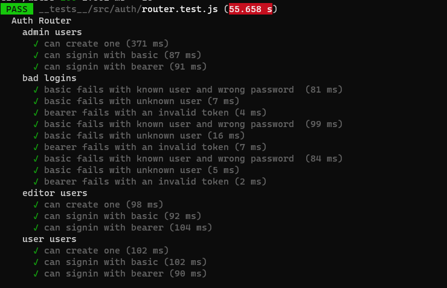
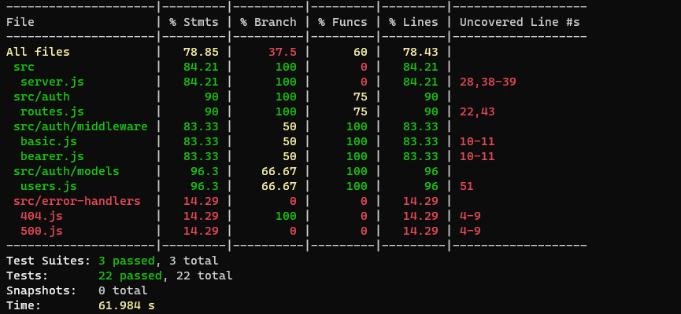

# basic-auth

## [Deployed App](https://basic-auth-wafa.herokuapp.com/)

Authentication System Phase 1: Deploy an Express server that implements Basic Authentication, with signup and signin capabilities, using a Mongo database for storage.

Authentication Server Phase 2: Token (Bearer) Authentication
At this point, our auth-server is able to allow a user to create an account as well as to handle Basic Authentication (user provides a username + password). When a “good” login happens, the user is considered to be “authenticated” and our auth-server generates a JWT signed “Token” which is returned to the application

Phase 1 :

✓  Make a POST request to the /signin route

✓  Send a basic authentication header with a properly encoded username and password combination

✓  On a successful account login, return a 200 status with the user object in the body

✓  On any error, trigger your error handler with the message “Invalid Login”

Phase 2 :


✓ Request sends an “Authorization” header, with the value of Bearer TOKEN

✓ Return TOKEN to the user after signin step 

✓ If the TOKEN is valid route should function as it normally would (sending a response)

✓ If not Send the user an error message stating “Invalid Login”

## authentication related files in ==> auth folder

Phase 1 :


✓ Extract the authentication logic for /signin as middleware

✓ Extract the mongo/schema into a separate module

✓ Create a module to house all of routes for the authentication system.

- Create a POST route for /signup

- Create a POST route for /signin

Phase 2 :

- GET route for /users

- GET route for /secret stuff

```
├── .gitignore
├── .eslintrc.json
├── __tests__
│   ├── basic-auth-middleware.test.js
│   ├── bearer-auth-middleware.test.js
│   ├── router.test.js
├── src
│   ├── auth
│   │   ├── routes.js
│   │   ├── middleware
│   │   │   ├── basic.js
│   │   │   ├── bearer.js
│   │   ├── models
│   │   │   ├── users.js
│   ├── error-handlers
│   │   ├── 404.js
│   │   ├── 500.js
│   │   ├── model-finder.js
│   ├── server.js
├── index.js
└── package.json
```

## Testing




<!-- ✓ POST to /signup to create a new user

✓ POST to /signin to login as a user (use basic auth)

✓ Need tests for auth middleware and the routes


[Actions](https://github.com/wafaankoush99/basic-auth/actions) -->


<!--  -->

## Dependencies 

- Express

- Dotenv

- Jest

- Morgan

- Bcrypt

- Mongoose

- Cors

- @code-fellows/supergoose

- jsonwebtoken

  <!-- "keywords": [],
  "author": "",
  "license": "ISC",
  "dependencies": {
    "@code-fellows/supergoose": "^1.0.11",
    "base-64": "^1.0.0",
    "bcrypt": "^5.0.0",
    "cors": "^2.8.5",
    "dotenv": "^8.2.0",
    "express": "^4.17.1",
    "jest": "^26.6.3",
    "jsonwebtoken": "^8.5.1",
    "mongoose": "^5.10.15",
    "morgan": "^1.10.0" -->
***

<!-- 

[PULL REQUEST (1) ](https://github.com/wafaankoush99/basic-auth/pull/1) -->
